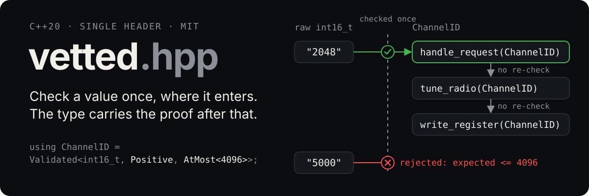
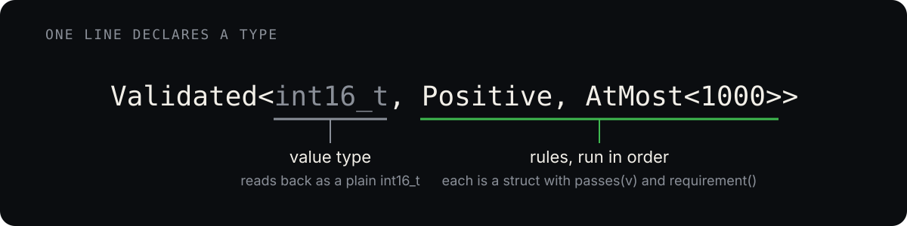

<p align="center">
  
</p>

A `vetted::Validated<T, Rules...>` is a `T` that is known to satisfy every rule.
The only way to make one is through a constructor that runs the rules, so any
function that receives one can use the value without checking it. Validation
happens in one place, where untrusted data enters, and the type carries the
proof through every layer below.

## The problem it removes

Say `handle_request()` calls `tune_radio()`, which calls `write_register()`,
and all three take a radio channel number. If that number is a plain
`int16_t`, none of them knows whether the caller already checked it. So they
all check:

```cpp
void write_register(int16_t channel) {
    if (channel < 1 || channel > 4096) throw std::invalid_argument("bad channel");
    ...
}
void tune_radio(int16_t channel) {
    if (channel < 1 || channel > 4096) throw std::invalid_argument("bad channel");
    write_register(channel);
}
void handle_request(int16_t channel) {
    if (channel < 1 || channel > 4096) throw std::invalid_argument("bad channel");
    tune_radio(channel);
}
```

That is three copies of the same rule, and a fourth layer would mean a fourth
copy. Change the rule and you have to go find them all.

Make "a channel number that has been checked" its own type instead:

```cpp
using ChannelID = vetted::Validated<int16_t, vetted::Positive, vetted::AtMost<4096>>;

void write_register(ChannelID channel) { ... }
void tune_radio(ChannelID channel)     { write_register(channel); }
void handle_request(ChannelID channel) { tune_radio(channel); }
```

No checks anywhere. The one place validation is visible is wherever untrusted
data first turns into a `ChannelID`:

```cpp
std::optional<ChannelID> parse_channel(std::string_view text) {
    int16_t raw = /* parse the digits */;
    return ChannelID::try_from(raw);   // nullopt if any rule fails
}
```

When the value is a constant, the compiler runs the rules during the build
and names the one that broke:

```
constexpr ChannelID oops{5000};
// error: constexpr variable 'oops' must be initialized by a constant expression
// note: non-constexpr function 'rule_violated<vetted::AtMost<4096>>' cannot be used in a constant expression
```

## Is it safer? Is it faster?

Safer, yes: a missing check becomes a compile error, the rule lives in one
line, and every place a raw value becomes a trusted one is greppable. Faster,
a little: the wrapper is the same size as the raw type and passes in
registers, and a validated call chain drops the range check from every layer.
The measurements and the caveats are in
[docs/safety-and-performance.md](docs/safety-and-performance.md).

## Using it

Copy `include/vetted.hpp` into your project, or add it with CMake:

```cmake
include(FetchContent)
FetchContent_Declare(vetted GIT_REPOSITORY https://github.com/aedrax/vetted.hpp.git GIT_TAG main)
FetchContent_MakeAvailable(vetted)

target_link_libraries(app PRIVATE vetted::vetted)
```

Or install it (`cmake --install build --prefix /some/where`) and use
`find_package(vetted REQUIRED)`. Either way the target is `vetted::vetted` and
it sets C++20 for you.

The snippets below assume `using namespace vetted;`, as the example code does.

## How it works

<p align="center">
  
</p>

A rule is a struct with two static functions. `passes` says whether a value
passes, and `requirement` states the condition for the error message:

```cpp
struct PowerOfTwo {
    static constexpr bool passes(auto v) { return v > 0 && (v & (v - 1)) == 0; }
    static std::string requirement() { return "a power of two"; }
};
```

`Validated` checks that every rule really has both functions, using a C++20
concept. It's a compile-time contract with no runtime cost. Forget `requirement()`
and the build stops at the `using` line:

```
error: constraints not satisfied for class template 'Validated' [with T = int, Rules = <Even>]
note: because 'Rule::requirement()' would be invalid: no member named 'requirement' in 'Even'
```

### Two ways in

| | When | On failure |
|---|---|---|
| `ChannelID{v}` | The value should never be wrong: constants, config, computed values | Throws `std::invalid_argument`, e.g. `value 5000: expected <= 4096`. In a `constexpr` context, the build fails instead. |
| `ChannelID::try_from(v)` | Untrusted input: user text, network, files | Returns `std::nullopt` |

## The toolbox

`vetted.hpp` ships with these. Most are three lines, so add your own freely.

| Rule | Passes when | Typical use |
|---|---|---|
| `Positive` | `v > 0` | counts, sizes |
| `NonNegative` | `v >= 0` | offsets, delays |
| `NonZero` | `v != 0` | divisors, strides (negative allowed) |
| `Even`, `Odd` | `v % 2 == 0`, `v % 2 != 0` | sample pairs, filter taps |
| `AtLeast<N>`, `AtMost<N>` | `v >= N`, `v <= N` | closed ranges |
| `GreaterThan<N>`, `LessThan<N>` | `v > N`, `v < N` | open ranges, `[0, size)` |
| `Between<Lo, Hi>` | both bounds inclusive | percentages, channels |
| `In<a, b, c>` | `v` equals one of them | baud rates, enum-like ints |
| `NotIn<a, b, c>` | `v` equals none of them | reserved pins |
| `PowerOfTwo` | one bit set | FFT sizes, buffer sizes |
| `MultipleOf<N>`, `Aligned<N>` | `v % N == 0` | DMA lengths, addresses |
| `FitsInBits<N>` | `0 <= v < 2^N` | register fields |
| `FitsIn<U>` | `v` is representable in integer type `U` | a safe narrowing cast, `FitsIn<int8_t>` |
| `OnlyBits<Mask>` | no bits set outside `Mask` | flag words |
| `HasBits<Mask>` | every bit in `Mask` set | a required enable bit |
| `Finite` | not NaN, not infinity | any float from outside. Put it first. |
| `NotNull` | `p != nullptr` | raw and copyable smart pointers. Put it first. |
| `PortNumber` | `1 <= v <= 65535` | with `Hostname` or `IpAddress` |
| `AllOf<R...>`, `AnyOf<R...>`, `Not<R>` | combine other rules | anything the above can't say alone |
| `Named<R, "text">` | `R` passes; the message says `"text"` | a readable message for a nested combinator |
| `Satisfies<lambda, "text">` | the lambda returns true | one-offs that don't deserve a struct |

For containers, any `T` with a `size()` you can iterate: strings, vectors, arrays, spans.

| Rule | Passes when |
|---|---|
| `NonEmpty` | `size() != 0` |
| `SizeIs<N>`, `SizeAtLeast<N>`, `SizeAtMost<N>` | `size()` compared with `N` |
| `SizeBetween<Lo, Hi>` | both bounds inclusive |
| `Each<R>` | every element passes `R`, so `Each<Between<-2048, 2047>>` |
| `Sorted` | ascending, equal neighbours allowed |
| `Unique` | no two elements equal |

For text, any `T` that converts to `std::string_view`. The named shapes check
the form of the text, at compile time when it is a constant. They do not
resolve names or cover every corner of the RFCs. Each rule states in the header
exactly what it accepts.

| Rule | Passes when |
|---|---|
| `StartsWith<"...">`, `EndsWith<"...">`, `Contains<"...">` | the text has that prefix, suffix or part |
| `OnlyChars<"...">` | every character is in the set |
| `Printable` | every character is `0x20..0x7E`: no control characters, nothing outside ASCII |
| `Utf8` | well-formed UTF-8. Also takes a container of bytes. |
| `Hostname` | dot-separated labels of letters, digits and hyphens. `localhost` passes. |
| `Ipv4Address`, `Ipv6Address`, `IpAddress` | four dotted octets; eight hex groups with one optional `::`; either |
| `EmailAddress` | `local@domain` with at least one dot in the domain |
| `Url` | a scheme, a colon, and something after it. No whitespace. |
| `MacAddress` | six hex pairs, all `:` or all `-` separated |
| `Uuid` | `8-4-4-4-12` hex digits, any case |

```cpp
using UpdateUrl = Validated<std::string_view, Url, StartsWith<"https://">>;
constexpr UpdateUrl default_update{"https://example.org/fw"};   // the compiler checks the shape
```

The last one is the escape hatch, and it brings back the lambda style:

```cpp
using PllDivider = Validated<int,
    Satisfies<[](auto v) { return v == 1 || v % 2 == 0; }, "1 or an even number">>;
```

### Chaining rules

List them, and they run in order:

```cpp
using FFTSize = Validated<int32_t, PowerOfTwo, AtMost<65536>>;
```

Rules can take template parameters, bundle into named combinations like
`Between<Lo, Hi>`, and nest with `AllOf`, `AnyOf` and `Not`. See
[docs/rules.md](docs/rules.md).

## Validated types in structs

They compose like any other member. A struct of validated fields carries the
same guarantee as its parts, its layout is identical to the raw version, and a
rule can span several fields at once. Wire formats stay raw and convert once
at the boundary. See [docs/structs.md](docs/structs.md).

## Limits

- The guarantee is only as good as the rules, so test them.
- A rule promises exactly what it says and no more. If a function needs
  `offset + size` to fit, the type has to promise that, not just `>= 0`.
- Arithmetic on a validated value produces a plain `T`, so the proof doesn't
  propagate through math. Reading out is free; only going in is guarded.
- It says "this number is in range" and nothing else. It is not memory safety
  or thread safety.

## The example

`examples/` holds a small radio-control program that exercises everything
above: the before-and-after call chain, the parsing boundary, structs of
validated fields, and one line per rule in the toolbox.

```sh
cmake -S . -B build && cmake --build build && ./build/vetted_example
```

To watch the compiler reject a bad constant:

```sh
cmake -S . -B build -DDEMO_COMPILE_ERROR=ON && cmake --build build
```

| Path | What's in it |
|---|---|
| `include/vetted.hpp` | The whole library. Everything is in `namespace vetted`. |
| `examples/domain.hpp` | The example's types: `ChannelID`, `FFTSize`, `Baud`, ... one line each, plus structs of them |
| `examples/main.cc` | The call chain before and after, the parsing boundary, and the demo |
| `docs/` | Rules in depth, validated types in structs, and the safety and performance notes |

## License

MIT. See [LICENSE](LICENSE).
